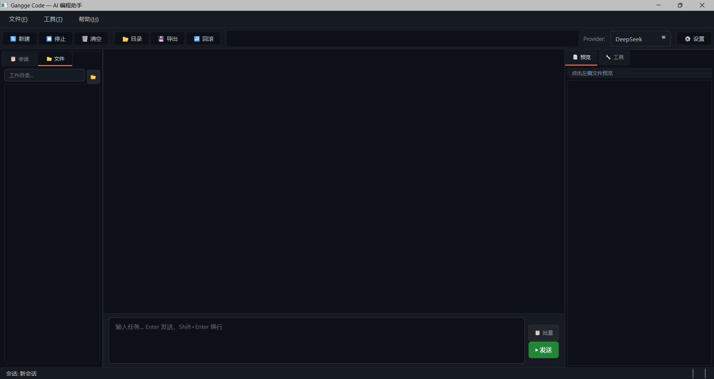

<div align="center">

# ⚡ Gangge Code

**AI 小说创作引擎 · 本地编程助手 — 写小说、写代码，一个工具全搞定**

<p align="center">
  
  
  
</p>

**📖 小说创作（Dramatica-Flow）· 💻 AI 编程助手 · 桌面 GUI**

[English](./README_EN.md) | 中文

> 在中间聊天窗口用自然语言写小说：说「加个角色」「改大纲」「写下一章」，AI 自动调用对应工具。同时保留完整的 AI 编程能力。

</div>

---

## 📖 核心功能：AI 小说创作引擎

Gangge Code 内置 **Dramatica-Flow** 完整小说创作系统，支持从构思到成稿的全流程：

### 🎯 聊天式创作
在主聊天窗口直接对话，AI 自动理解意图并操作：
- 「给主角加一个青梅竹马」→ 自动修改角色配置
- 「第三章的剧情太无聊了，加点悬念」→ 调整章纲
- 「帮我看看现在的进度」→ 显示详细状态
- 「写下一章」→ 执行写作流水线
- **选书后自动注入上下文**：角色、大纲、伏笔、世界状态全部加载到 system prompt，LLM 精准理解你的项目

### 🏗️ 五层写作流水线
1. **Architect 规划师** — 分析大纲、世界状态、前文摘要，生成章节蓝图
2. **Writer 作家** — 基于蓝图撰写正文，保持风格一致
3. **Post-write 校验** — 提取因果链、生成摘要、更新世界状态
4. **Auditor 审计员** — 检查逻辑漏洞、伏笔一致性、角色行为合理性
5. **Reviser 修订者** — 根据审计反馈自动修订，循环直到通过

### 🔧 16 个专用工具
| 工具 | 功能 |
|------|------|
| `novel_init` | 创建新书籍项目 |
| `novel_setup` | 配置角色/势力/地点/世界规则 |
| `novel_outline` | 生成/重新生成故事大纲 |
| `novel_chapter_outlines` | 展开每章详细节拍 |
| `novel_write_chapter` | 写一章（支持快速模式） |
| `novel_audit` | 审计已写章节 |
| `novel_revise` | 根据反馈修订章节 |
| `novel_status` | 查看详细进度和状态 |
| `novel_edit` | 修改任意元素（角色/关系/伏笔/大纲/章节） |
| `novel_export` | 导出全书（TXT/EPUB） |
| `novel_list_books` | 列出所有书籍 |
| `novel_navigate` | 快速定位读取文件（章节/角色/大纲/状态） |
| `novel_graph_query` | 查询叙事知识图谱 |
| `novel_consistency_check` | 全书一致性检查 |
| `novel_graph_rebuild` | 重建叙事图谱 |
| `novel_import` | 导入 TXT 小说进行仿写分析 |

### 📚 导入与仿写
- 支持导入几十万字的 TXT 小说文件
- 多区域采样分析写作风格（开头、中段、结尾）
- 全文扫描提取角色信息
- 结构化分析剧情弧线、转折点、情感轨迹
- 动态风格锚定：根据当前写作进度匹配参考文本
- 大文件自动分块处理（>50 万字拆分为 10 万字块）

### ⚡ 性能优化
- **快速模式**：跳过 Architect 规划和 Audit-Revision 循环，速度提升 3x+
- **并行 LLM 调用**：因果链提取和摘要生成并行执行
- **直接执行**：绕过 Agentic Loop 开销，直接调用工具
- **上下文压缩**：长篇小说自动压缩历史摘要，保持上下文窗口可控
- **定期深度审查**：每 N 章触发全量一致性检查

### 🎨 专业 UI 面板
- **仪表盘 Dashboard** — 总览进度、统计、快捷操作
- **角色 Characters** — 可视化管理角色、编辑属性、查看弧线
- **大纲 Outline** — 树形展示故事弧线、拖拽调整顺序
- **章节 Chapters** — 列表管理所有章节、一键写作/审计/修订
- **世界观 Worldview** — 地点、势力、世界规则一览
- **追踪 Tracking** — 伏笔管理、因果链可视化、情感曲线
- **词库 Word Bank** — 自定义词汇库、风格参考

### 🧠 叙事知识图谱
- 基于 CodeGraph 架构设计的叙事建模系统
- 角色、事件、关系作为图节点和边存储
- SQLite 持久化，支持复杂查询
- 自动追踪因果关系链和伏笔闭合状态

---

## ✨ 特色对比

| | Gangge Code | ChatGPT / Copilot | Claude Code | 专用写作软件 |
|--|--|--|--|--|
| **AI 小说创作** | ✅ Dramatica-Flow | ❌ | ❌ | ❌ 无 Agent 能力 |
| **聊天式写小说** | ✅ 自然语言驱动 | ❌ | ❌ | ❌ 固定流程 |
| **五层写作流水线** | ✅ 自动规划→写→审→改 | ❌ | ❌ | ❌ 单层输出 |
| **导入仿写** | ✅ 几十万字 TXT | ❌ | ❌ | ❌ 小文件限制 |
| **叙事知识图谱** | ✅ 因果链+伏笔追踪 | ❌ | ❌ | ❌ |
| 自主调用工具 | ✅ | ❌ 只输出代码 | ✅ | ❌ |
| 本地完全运行 | ✅ | ❌ | ❌ 需订阅 | ❌ 云端依赖 |
| DeepSeek 原生支持 | ✅ 成本低 10x | ❌ | ❌ | ❌ |
| 桌面 GUI | ✅ PyQt6 | ❌ | ❌ | 部分 |
| Shadow Git 回滚 | ✅ | ❌ | ✅ | ❌ |
| Memory Bank 跨会话 | ✅ | ❌ | ✅ | ❌ |
| LSP 语法检查 | ✅ | ❌ | ❌ | ❌ |
| 批量任务队列 | ✅ | ❌ | ❌ | ❌ |
| MCP 外部工具接入 | ✅ | ❌ | ✅ | ❌ |
| 完全开源可改 | ✅ | ❌ | ❌ | ❌ |

---

## 🚀 快速安装

### 1. 克隆项目

```bash
git clone https://github.com/ydsgangge-ux/gangge-code.git
cd gangge-code
```

### 2. 安装（三选一）

```bash
# 方式 A：最小安装（CLI + TUI + 小说创作）
pip install -e .

# 方式 B：带桌面 GUI（推荐）
pip install -e ".[gui]"

# 方式 C：全部安装（GUI + 开发工具）
pip install -e ".[all]"
```

### 3. 配置 API Key

```bash
cp .env.example .env
# 编辑 .env，填入你的 API Key
```

最小配置（DeepSeek）：
```ini
LLM_PROVIDER=deepseek
DEEPSEEK_API_KEY=sk-xxx
```

### 4. 开始使用

```bash
# 桌面 GUI（推荐，完整体验小说创作+编程）
python desktop/app.py
# 或 Windows 双击 desktop/run.bat

# 单次任务（编程模式）
gangge "创建一个带用户认证的 FastAPI 项目"

# 交互式 REPL
gangge
```

---

## 📖 小说创作使用流程

### 第一步：创建书籍
1. 启动桌面 GUI
2. 左侧面板点击「新建书籍」
3. 填写书名、题材、目标章数、每章字数

### 第二步：配置世界观
1. 切换到「角色」tab，添加主要角色（姓名、身份、性格、人物弧线）
2. 切换到「世界观」tab，添加重要地点和势力
3. 或直接让 AI 自动生成：「帮我配一套仙侠小说的角色和世界观」

### 第三步：生成大纲
1. 切换到「大纲」tab
2. 点击「生成大纲」按钮
3. Architect 会基于角色和世界观生成完整的故事弧线
4. 可以手动编辑或让 AI 调整：「在大纲里加一个反转」

### 第四步：展开章纲
1. 点击「展开章纲」
2. 每章会生成详细的节拍清单（场景、冲突、情感走向）

### 第五步：开始写作
1. 切换到「章节」tab
2. 选择要写的章节，点击「写章节」（可开启快速模式加速）
3. Writer 基于章纲和前文撰写正文
4. Auditor 自动检查质量，不通过则自动修订

### 第六步：聊天式调整（随时可用）
在中间聊天窗口直接输入：
- 「第五章的主角反应不够强烈，改一下」
- 「加一个伏笔，关于主角的身世」
- 「看看现在的整体进度」
- 「导出前十章」

### 高级功能：仿写模式
1. 点击「导入小说」上传 TXT 文件
2. 系统自动分析原文的写作风格、角色、结构
3. 创建新书时选择「仿写模式」
4. 写作时自动模仿目标风格

---

## 🎬 运行效果

<p align="center">
  
  <br/>
  <em>桌面端 GUI — 小说创作面板 + AI 编程助手</em>
</p>

```
📋 任务分析
技术栈：FastAPI + SQLAlchemy + SQLite

✅ 任务清单 (0/6)
1. [ ] 创建项目结构 — app/, routes/, models/
2. [ ] 数据模型层   — models/user.py
3. [ ] 认证模块     — routes/auth.py
...

▶ 开始执行第 1 步
  ▶ bash(mkdir -p app/routes app/models)
  ✓ write_file: 已写入 app/models/user.py (42 行)
✅ 1/6 已完成
```

---

## 🛠️ 编程助手功能

### Agent 引擎
- **30 轮 Plan & Execute 循环** — 分析 → 调工具 → 看结果 → 继续，直到完成
- **首轮必出规划** — 模块清单 + 任务步骤 + 文件结构
- **ask_user 暂停等待** — AI 需要信息时暂停提问，用户回答后继续
- **测试验证保障** — 文件写完自动运行 pytest，失败自动修复
- **上下文管理** — 滑动窗口 + 工具结果截断 + 文件索引懒加载，节省 Token
- **进度发射器** — 每步执行自动推送进度，实时可见

### 13+ 个内置编程工具
`bash` · `read_file` · `write_file` · `edit_file` · `grep` · `glob` · `list_dir` · `web_fetch` · `ask_user` · `lint_check` · `find_symbol` · `find_references` · `create_tool`

### 符号导航
- **`find_symbol`** — 按名称查找类、函数、方法，精确定位文件、行号和类型
- **`find_references`** — 查找符号的所有引用位置，支持跨文件追踪
- **仓库索引** — 基于 AST 的多语言符号扫描（Python/JS/TS/JSX/TSX），增量缓存至 `.gangge/repo_index.json`

### 安全与回滚
- **Shadow Git Checkpoint** — AI 修改前自动创建 Git 检查点，一键回滚
- **LSP 语法检查** — 写完代码自动运行 pyright/ruff 检查，错误即时修复
- **权限控制** — 规则引擎 + 危险检测，系统目录写入自动拦截
- **批判者自检** — System Prompt 内置自检规范，提交前检查语法/逻辑/依赖/风格

### AI 自建工具
- **`create_tool`** — AI 在运行时自行创建新工具，4 重安全门检测（危险代码 → 接口合规 → 重复检测 → 动态加载验证）
- **插件系统** — 自建工具自动保存到 `.gangge/plugins/`，下次启动自动加载恢复

### 项目管理
- **Memory Bank** — `.gangge/` 目录跨会话记录项目进度 + 决策日志
- **Decision Log** — 记录"为什么这么做"，防止 AI 重复犯错
- **会话持久化** — SQLite 存储，随时恢复历史会话
- **文件变更 Diff** — 每次修改自动生成 unified diff，绿色新增 / 红色删除

### 四种使用形态

| 形态 | 命令 | 适合场景 |
|------|------|---------|
| **单次执行** | `gangge "任务描述"` | 快速任务，CI/CD |
| **管道模式** | `cat error.log \| gangge "分析"` | 日志分析，Shell 脚本 |
| **交互 REPL** | `gangge` | 多轮对话，持续开发 |
| **桌面 GUI** | `python desktop/app.py` | 小说创作 + 完整项目开发 |

### 桌面 GUI 专属功能
- **VSCode 风格三栏布局** — 左侧(会话+文件) | 中间(聊天+输入) | 右侧(预览+工具)
- **独立文件预览** — 点击文件在右侧面板预览，不污染聊天记录
- **一键停止** — 执行中随时点击红色停止按钮取消任务
- **批量任务队列** — 多行输入，依次自动执行
- **计划确认** — 规划模式下先出方案，你批准后再执行
- **Diff 回滚** — 查看变更 Diff 并一键回滚到修改前状态
- **国际化** — 内置中英文语言包，根据系统语言自动切换

### 可扩展性
- **`.ganggerules`** — 项目根目录定义编码规范、测试要求、架构约定
- **MCP 协议支持** — 完整的 MCP 客户端管理器，支持 stdio 和 SSE 两种传输方式
- **MCP Server 接入** — 通过 `.gangge/mcp_servers.json` 配置，自动连接并注册工具（AutoCAD、FreeCAD、数据库、浏览器...）
- **ComfyUI 集成** — 启动时自动检测本地 ComfyUI 实例，检测到后自动激活图像生成工具

---

## 📐 架构

```
用户界面层 (Layer 1)
  CLI gangge "任务"  ──┐
  管道 cat x | gangge ─┤
  REPL gangge         ─┤──► AgenticLoop（核心引擎 Layer 3）
  TUI terminal.py     ─┤       │
  GUI desktop/app.py  ─┘       ├─ 工具执行层 (Layer 3 tools)
                               │    bash · file_ops · grep · glob · list_dir
                               │    web_fetch · ask_user · lint_check
                               │    find_symbol · find_references · create_tool
                               │    └── 插件工具 (.gangge/plugins/)
                               │    └── 小说工具 (16个) ← Dramatica-Flow
                               │         novel_* 系列
                               ├─ MCP 工具层 (Layer 4)
                               │    MCP Client (stdio/SSE) → 外部 Server
                               │    └── ComfyUI 图像生成
                               ├─ 会话管理层 (Layer 2)
                               │    持久化 · Memory Bank · 压缩
                               ├─ 权限安全层 (Layer 4)
                               │    规则引擎 · 危险检测 · Shadow Git
                               └─ LLM 适配层 (Layer 5)
                                    DeepSeek · OpenAI · Claude · Ollama
```

---

## ⚙️ 配置

**`.env` 环境变量**

```ini
LLM_PROVIDER=deepseek          # deepseek / openai / anthropic / ollama
DEEPSEEK_API_KEY=sk-xxx
DEEPSEEK_MODEL=deepseek-chat

MAX_ROUNDS=30                  # 最大工具调用轮数
MAX_TOKENS=8192
TEMPERATURE=0.0
```

**`.ganggerules` 项目规则**（放项目根目录）

```markdown
# 编码规范
- 所有注释用中文
- 每个新函数必须写 pytest 测试
- 数据库操作只在 repositories/ 目录
```

---

## 📁 项目结构

```
gangge-code/
├── desktop/
│   ├── app.py              # PyQt6 桌面主程序（含小说创作面板）
│   ├── run.bat             # Windows 一键启动
│   └── run.ps1             # PowerShell 启动
├── src/gangge/
│   ├── cli.py              # CLI 入口
│   ├── cli_repl.py         # 交互式 REPL
│   ├── pricing.py          # Token 计费统计
│   ├── layer1_ui/          # TUI 界面（Textual 框架）
│   ├── layer2_session/     # 会话管理（SQLite + Memory Bank）
│   │   ├── manager.py      #   会话管理器
│   │   ├── context.py      #   上下文压缩
│   │   ├── state.py        #   会话状态
│   │   └── storage.py      #   SQLite 持久化
│   ├── layer3_agent/       # 核心引擎
│   │   ├── loop.py         #   Agentic Loop
│   │   ├── planner.py      #   Plan & Execute 规划器
│   │   ├── progress_emitter.py  # 进度推送
│   │   ├── prompts/
│   │   │   └── system.py   #   System Prompt
│   │   └── tools/
│   │       ├── base.py     #   工具基类 + ToolResult
│   │       ├── registry.py #   工具注册中心（统一管理 33+ 工具）
│   │       ├── bash.py     #   Shell 命令执行
│   │       ├── file_ops.py #   文件读写编辑
│   │       ├── search.py   #   grep/glob/list_dir 搜索
│   │       ├── web.py      #   网页内容获取
│   │       ├── ask_user.py #   用户提问
│   │       ├── lint_check.py   # LSP 语法检查
│   │       ├── symbol.py   #   符号查找 + 引用追踪
│   │       ├── create_tool.py  # AI 自建工具
│   │       ├── comfyui_tool.py # ComfyUI 图像生成
│   │       └── novel.py    #   ★ 小说创作工具集（16个）
│   ├── dramatica/          # ★ Dramatica-Flow 小说引擎
│   │   ├── pipeline.py     #   五层写作流水线
│   │   ├── agents/         #   Architect/Writer/Auditor/Reviser
│   │   ├── state/          #   StateManager 世界状态管理
│   │   ├── narrative/      #   叙事模块（因果链/伏笔/情感弧）
│   │   └── validators/     #   一致性校验器
│   ├── layer4_permission/  # 权限安全
│   │   ├── guard.py        #   安全守卫
│   │   ├── rules.py        #   规则引擎
│   │   └── danger.py       #   危险操作检测
│   ├── layer4_tools/       # 基础设施工具
│   │   ├── shadow_git.py   #   Git 检查点 / 回滚
│   │   ├── mcp_client.py   #   MCP 客户端 (stdio + SSE)
│   │   ├── repo_index.py   #   仓库符号索引
│   │   └── plugin_loader.py    # 插件加载器
│   └── layer5_llm/         # LLM 适配（4 种 provider）
│       ├── base.py         #   基类 + ToolDefinition
│       ├── registry.py     #   Provider 注册
│       ├── deepseek.py     #   DeepSeek 适配
│       ├── anthropic.py    #   Claude 适配
│       └── openai_compat.py    # OpenAI / Ollama 适配
├── tests/
│   ├── test_core.py        # 核心模块测试
│   ├── test_architecture.py    # 架构分层合规测试
│   ├── test_mcp_integration.py # MCP 集成测试
│   └── test_items.py       # 桌面 GUI 路由测试
├── .env.example            # 环境变量模板
├── pyproject.toml          # 项目配置
├── requirements.txt        # 依赖列表
└── LICENSE                 # MIT 开源协议
```

---

## 🧪 测试

```bash
# 运行全部测试
pytest tests/ -v

# 运行核心模块测试
pytest tests/test_core.py -v

# 只运行 AgenticLoop 测试
pytest tests/test_core.py -v -k "test_loop"

# 架构分层合规测试
pytest tests/test_architecture.py -v

# MCP 集成测试
pytest tests/test_mcp_integration.py -v

# 带覆盖率
pytest tests/ --cov=src/gangge --cov-report=term-missing
```

---

## 🗺️ Roadmap

- [x] ★ Dramatica-Flow 小说创作引擎集成
- [x] ★ 16 个专用小说工具
- [x] ★ 聊天式自然语言创作
- [x] ★ 导入仿写（大文件 TXT 支持）
- [x] ★ 叙事知识图谱
- [x] ★ 五层写作流水线
- [x] ★ 小说专用 UI 面板（7 个 tab）
- [x] CLI / REPL / TUI / PyQt6 桌面端
- [x] Memory Bank 跨会话上下文 + Decision Log
- [x] Shadow Git 检查点（每步可回滚）
- [x] LSP 语法检查（pyright/ruff/pylint）
- [x] ask_user 暂停等待用户输入
- [x] VSCode 风格桌面 GUI（三栏布局 + 文件预览 + 停止按钮）
- [x] 符号查找 + 引用追踪（find_symbol / find_references）
- [x] AI 自建工具（create_tool + 插件系统）
- [x] MCP 完整协议支持（stdio + SSE 双传输）
- [x] ComfyUI 图像生成（自动检测激活）
- [ ] 国际化 (i18n) 英语语言包
- [ ] Web UI（远程访问）
- [ ] 向量索引 (RAG) 局部上下文
- [ ] EPUB 导出格式支持
- [ ] 多人协作写作
- [ ] 小说云端同步

---

## 🤝 Contributing

欢迎 PR 和 Issue！

如果觉得有用，请点个 ⭐ — 这对项目帮助很大。

---

## 📜 License

MIT © [ydsgangge-ux](https://github.com/ydsgangge-ux)
